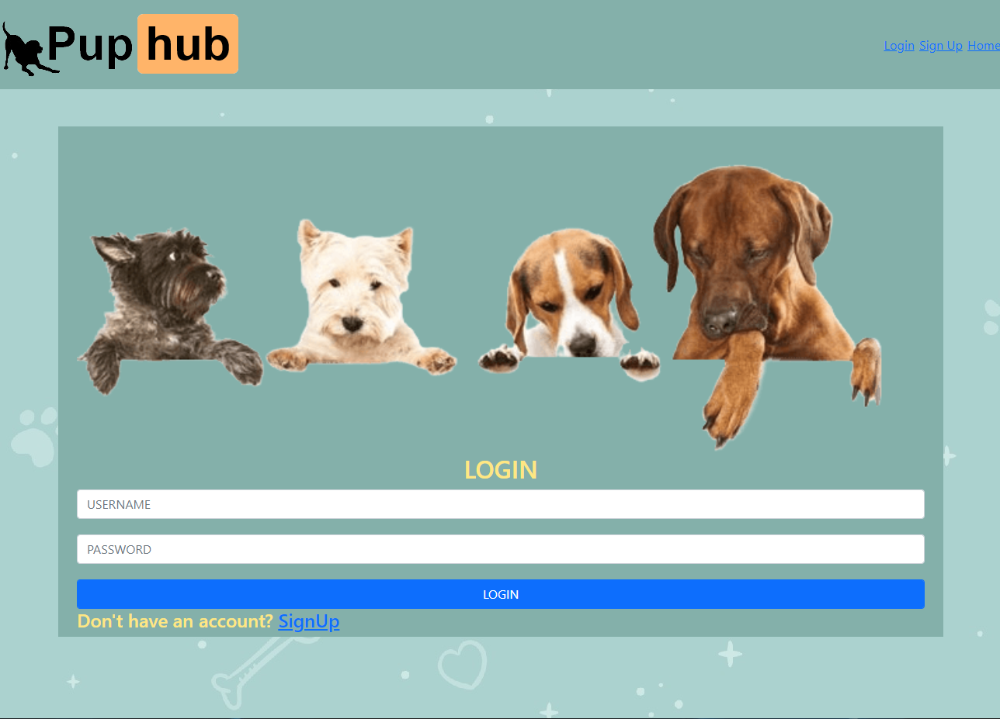

# Puphub


***

[](https://opensource.org/licenses/MIT)

Group Project #2 for UNH Full-Stack Web Development Boot Camp.

***

## Puphub Development Team Members

- [Tracy Angell](https://www.github.com/tracye1083)
- [Marla Jane](https://github.com/MarlaJane)
- [Paul Marceau](https://github.com/pmarceaujr)

***

## Description

You’ve heard of services like Angie’s List, well we wanted to make Puphub the “Angie’s List” for dog related services! Every dog owner goes through the struggles of finding a good vet, or groomer etc and when owners meet up they always dish the deets verbally so why not give them a platform to let their voices be heard by all!We have provided a site that you can easily search and review local dog related companies.

***

## Table of Contents

- [Technology Used](#technology-used)
- [NPM Packages Used](#npm-packages-used)
- [Links](#links)
- [Screen Capture](#screen-capture)
- [User Story](#user-story)
- [Usage](#usage)
- [Credits](#credits)
- [Questions](#questions)
- [License](#license)

***

## Technology Used

- [Visual Studio Code](https://code.visualstudio.com/)
- [MySQL Workbench](https://www.mysql.com/products/workbench/)
- [Heroku](https://www.heroku.com/)
- [GitHub GUI](https://desktop.github.com/)
- [GitHub](https://www.github.com)

***

## NPM Packages Used

- [@fortawesome/fontawesome-free](https://www.npmjs.com/package/@fortawesome/fontawesome-free)
- [autoprefixer](https://www.npmjs.com/package/autoprefixer)
- [bcrypt](https://www.npmjs.com/package/bcrypt)
- [body-parser](https://www.npmjs.com/package/body-parser)
- [Bootstrap](https://www.npmjs.com/package/bootstrap)
- [connect-flash](https://www.npmjs.com/package/connect-flash)
- [connect-session-sequelize](https://www.npmjs.com/package/connect-session-sequelize)
- [dotenv](https://www.npmjs.com/package/dotenv)
- [eslint](https://www.npmjs.com/package/eslint)
- [eslint-config-prettier](https://www.npmjs.com/package/eslint-config-prettier)
- [express](https://www.npmjs.com/package/express)
- [express-handlebars](https://www.npmjs.com/package/express-handlebars)
- [express-session](https://www.npmjs.com/package/express-session)
- [handlebars](https://www.npmjs.com/package/handlebars)
- [modules](https://www.npmjs.com/package/modules)
- [MySQL2](https://www.npmjs.com/package/mysql2)
- [node](https://www.npmjs.com/package/node)
- [nodemon](https://www.npmjs.com/package/nodemon)
- [postcss-cli](https://www.npmjs.com/package/postcss-cli)
- [prettier](https://www.npmjs.com/package/prettier)
- [Sass](https://www.npmjs.com/package/sass)
- [Sequelize](https://www.npmjs.com/package/sequelize)

***

## Links

### Github Repository

- [GitHub Repository](https://github.com/tracye1083/Puphub)

### Heroku Application Page

- [Puphub Heroku Application](https://desolate-mountain-07284.herokuapp.com/)

***

## Screen Capture

### Screenshot



***

## User Story

```md
JANET has a new puppy,
SHE WANTS to find services in her area with positive reviews
SO THAT she can get the best for her new fur baby.
```

***

## Usage

This application is used to search for companies relevant to being a dog owner. Need a groomer and want to know what others have said about them? Search our site and see!

***

## Credits

Our full-stack web development course is being offered as a collaboration between Trilogy Education Services and UNH Professional Development and Training.

- Instructor - Benjamin Hutchins [GitHub](https://github.com/benhutchins)
- TA - Andrew Hatfield

***

## Questions

If you have any questions about the repo you can open an issue.

You can find more of our work on Github:

- [Tracy Angell](https://www.github.com/tracye1083)
- [Marla Jane](https://github.com/MarlaJane)
- [Paul Marceau](https://github.com/pmarceaujr)

***

## License

This project is licensed under the [MIT License](https://choosealicense.com/licenses/mit).

Copyright (c) 2021 Puphub

Permission is hereby granted, free of charge, to any person obtaining a copy of this software and associated documentation files (the "Software"), to deal in the Software without restriction, including without limitation the rights to use, copy, modify, merge, publish, distribute, sublicense, and/or sell copies of the Software, and to permit persons to whom the Software is furnished to do so, subject to the following conditions:

The above copyright notice and this permission notice shall be included in all copies or substantial portions of the Software.

THE SOFTWARE IS PROVIDED "AS IS", WITHOUT WARRANTY OF ANY KIND, EXPRESS OR IMPLIED, INCLUDING BUT NOT LIMITED TO THE WARRANTIES OF MERCHANTABILITY, FITNESS FOR A PARTICULAR PURPOSE AND NONINFRINGEMENT. IN NO EVENT SHALL THE AUTHORS OR COPYRIGHT HOLDERS BE LIABLE FOR ANY CLAIM, DAMAGES OR OTHER LIABILITY, WHETHER IN AN ACTION OF CONTRACT, TORT OR OTHERWISE, ARISING FROM, OUT OF OR IN CONNECTION WITH THE SOFTWARE OR THE USE OR OTHER DEALINGS IN THE
SOFTWARE.
